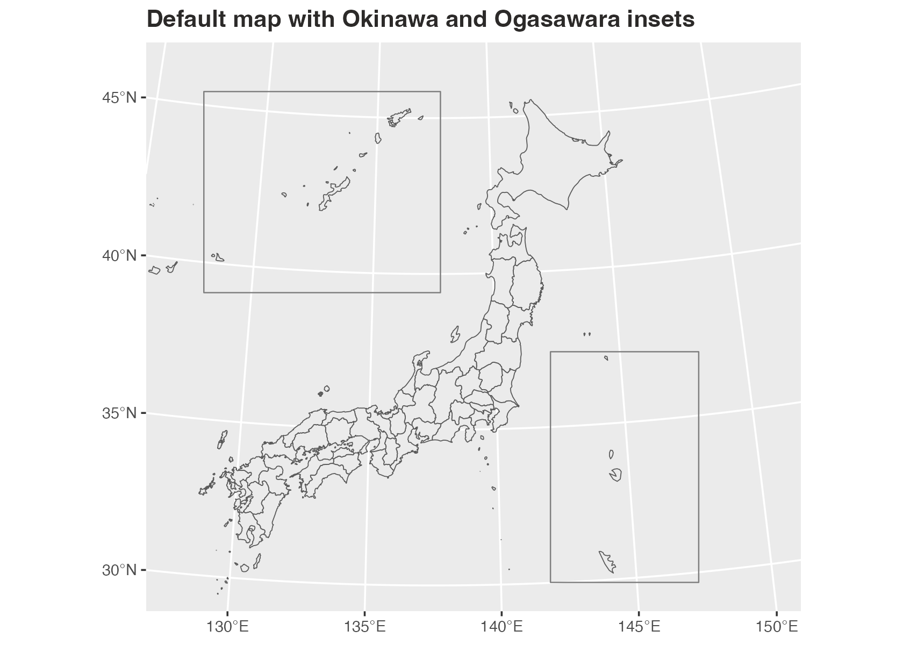
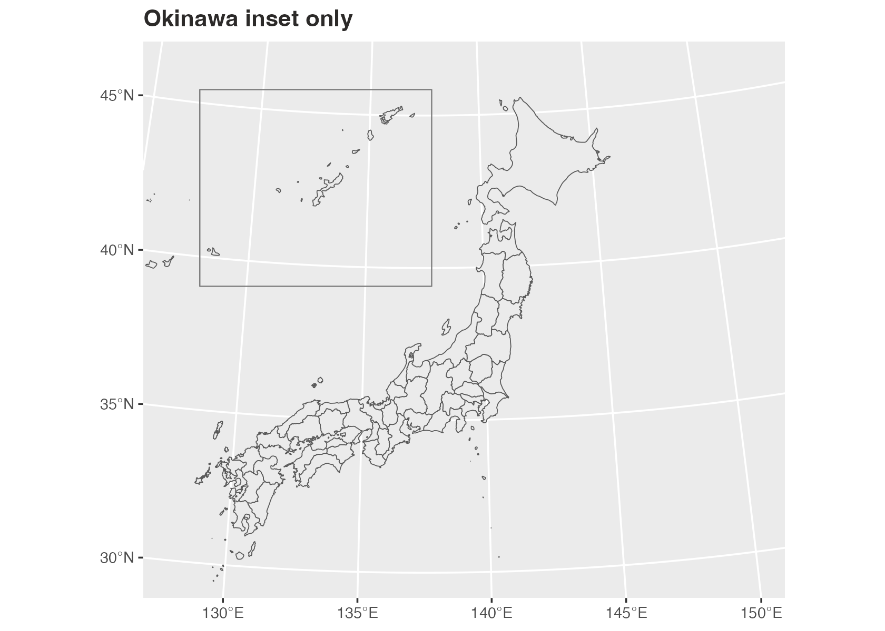
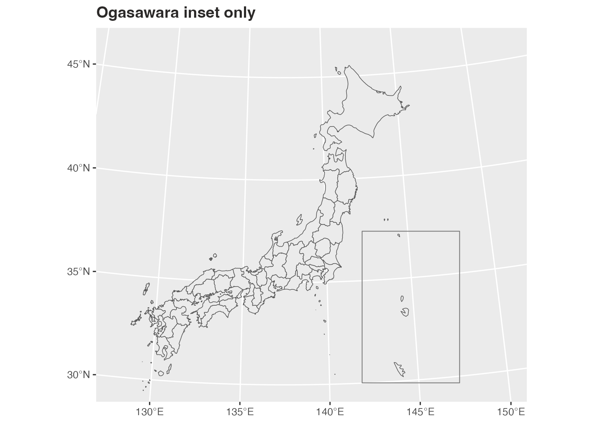
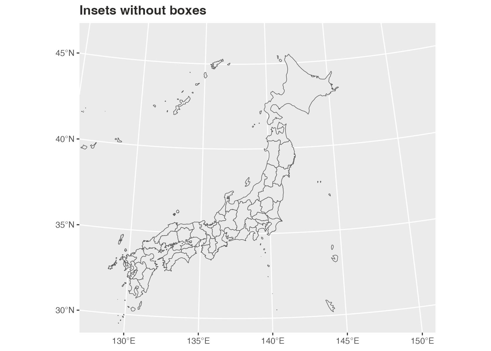
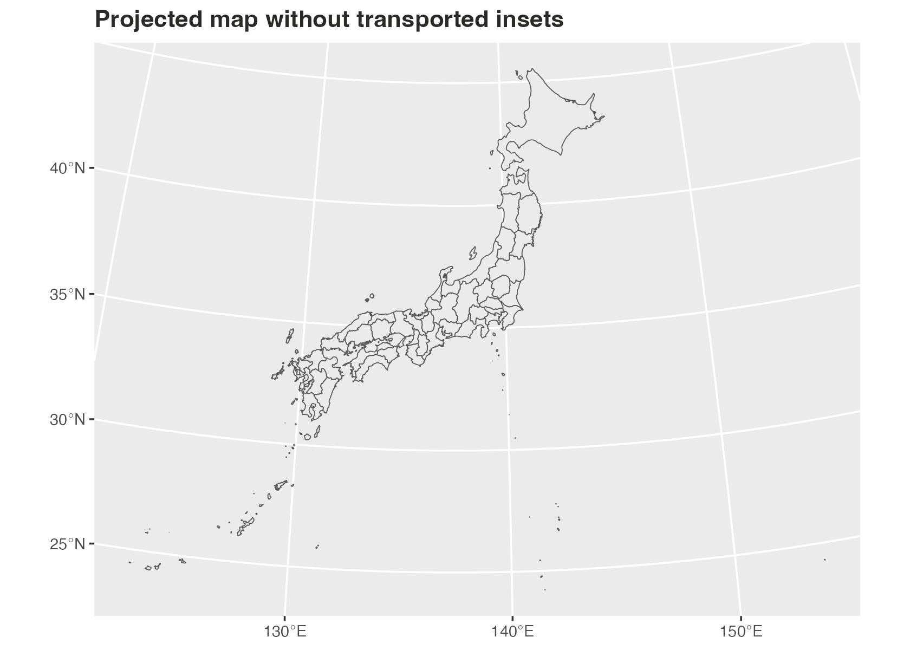

# Okinawa and Ogasawara Insets

By default, `jpmap` transports Okinawa and Ogasawara into visible inset
locations.

``` r

library(ggplot2)
library(jpmap)
```

``` r

plot_jpmap("prefecture") +
  labs(title = "Default map with Okinawa and Ogasawara insets") +
  theme(
    plot.title = element_text(face = "bold", color = "#2C2A29")
  )
```



## Remove One Inset

Use `ogasawara = FALSE` when you only want Okinawa moved.

``` r

plot_jpmap(
  "prefecture",
  ogasawara = FALSE
) +
  labs(title = "Okinawa inset only") +
  theme(
    plot.title = element_text(face = "bold", color = "#2C2A29")
  )
```



Use `okinawa = FALSE` when you only want Ogasawara moved.

``` r

plot_jpmap(
  "prefecture",
  okinawa = FALSE
) +
  labs(title = "Ogasawara inset only") +
  theme(
    plot.title = element_text(face = "bold", color = "#2C2A29")
  )
```



## Remove The Boxes

Set `inset_boxes = FALSE` to keep the transported islands but remove the
visual frames.

``` r

plot_jpmap(
  "prefecture",
  inset_boxes = FALSE
) +
  labs(title = "Insets without boxes") +
  theme(
    plot.title = element_text(face = "bold", color = "#2C2A29")
  )
```



## Use Literal Geography

Set `inset = FALSE` to keep every geometry in its projected geographic
location.

``` r

plot_jpmap(
  "prefecture",
  inset = FALSE
) +
  labs(title = "Projected map without transported insets") +
  theme(
    plot.title = element_text(face = "bold", color = "#2C2A29")
  )
```



## What The Boxes Mean

The inset boxes are visual guide frames for the transported island
groups. They are not legal boundary extents, and they should not be read
as a promise that every island in every source layer is inside a box.

For Okinawa municipal maps, the bundled 2024 MLIT N03 Okinawa layer is
transported as Okinawa. For Ogasawara, the default box is meant to frame
the main Ogasawara inset cluster. Some Tokyo islands in source data,
especially the Izu Islands and very remote islands such as
Minamitorishima or Okinotorishima when present, may appear outside that
box or outside the default plotting frame. Use `inset = FALSE` when
complete geographic placement matters more than a compact display.
