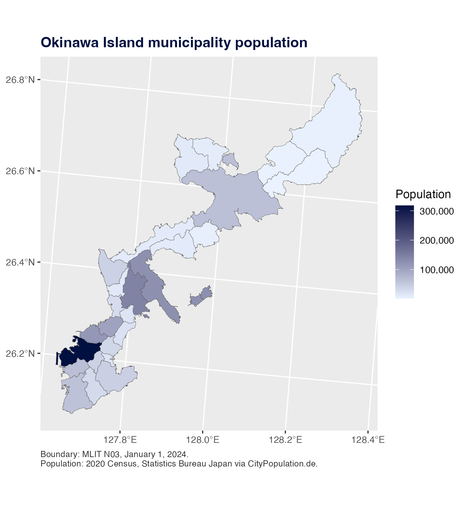

# Plot Municipal Choropleth Maps

This example uses official MLIT N03 municipal boundaries for Okinawa
Prefecture as of January 1, 2024. It maps one simple fill variable: 2020
census population by municipality. The figure focuses on Okinawa Island
so the municipal boundaries are legible; the source boundary file can
still contain the rest of Okinawa Prefecture.

Population values are 2020 Census values from Statistics Bureau Japan as
tabulated by
[CityPopulation.de](https://www.citypopulation.de/en/japan/admin/47__okinawa/).

``` r

library(tidyverse)
library(jpmap)

okinawa_main_island <- c(
  "那覇市", "宜野湾市", "浦添市", "名護市", "糸満市", "沖縄市",
  "豊見城市", "うるま市", "南城市", "国頭村", "大宜味村", "東村",
  "今帰仁村", "本部町", "恩納村", "宜野座村", "金武町", "読谷村",
  "嘉手納町", "北谷町", "北中城村", "中城村", "西原町", "与那原町",
  "南風原町", "八重瀬町"
)

okinawa_population_2020 <- tribble(
  ~municipality_ja, ~population_2020,
  "那覇市", 317625L,
  "宜野湾市", 100125L,
  "浦添市", 115690L,
  "名護市", 63554L,
  "糸満市", 61007L,
  "沖縄市", 142752L,
  "豊見城市", 64612L,
  "うるま市", 125303L,
  "南城市", 44043L,
  "国頭村", 4517L,
  "大宜味村", 3092L,
  "東村", 1598L,
  "今帰仁村", 8894L,
  "本部町", 12530L,
  "恩納村", 10869L,
  "宜野座村", 5833L,
  "金武町", 10806L,
  "読谷村", 41240L,
  "嘉手納町", 13521L,
  "北谷町", 28201L,
  "北中城村", 17969L,
  "中城村", 22157L,
  "西原町", 34984L,
  "与那原町", 19695L,
  "南風原町", 40440L,
  "八重瀬町", 30941L
)

okinawa_main_island_min_area <- 5e6
keep_okinawa_main_island <- function(map) {
  filtered <- map |>
    filter(municipality_ja %in% okinawa_main_island)

  filtered |>
    mutate(area_m2 = as.numeric(sf::st_area(filtered))) |>
    filter(area_m2 >= okinawa_main_island_min_area) |>
    select(-area_m2)
}

okinawa_main_map <- jp_map("municipality", include = "Okinawa", inset = FALSE) |>
  keep_okinawa_main_island() |>
  jp_map_join(okinawa_population_2020, by = "municipality_ja")
```

``` r

ggplot(okinawa_main_map) +
  geom_sf(
    aes(fill = population_2020),
    color = "grey35",
    linewidth = 0.12
  ) +
  coord_sf(
    crs = jpmap_crs(),
    datum = sf::st_crs(4326)
  ) +
  scale_fill_gradient(
    low = "#EAF2FF",
    high = "#001040",
    labels = function(x) format(x, big.mark = ",", scientific = FALSE),
    name = "Population"
  ) +
  labs(
    title = "Okinawa Island municipality population",
    caption = paste(
      "Boundary: MLIT N03, January 1, 2024.",
      "Population: 2020 Census, Statistics Bureau Japan via CityPopulation.de.",
      sep = "\n"
    )
  ) +
  theme_gray() +
  theme(
    axis.title = element_blank(),
    panel.grid.minor = element_blank(),
    legend.background = element_rect(fill = "white", color = NA),
    plot.title = element_text(face = "bold", color = "#001040"),
    plot.caption = element_text(color = "#2C2A29", hjust = 0, size = 8)
  )
```



For other prefectures, first build the prefecture’s municipal boundaries
with `jpmap_build_data(year = 2024, prefecture = "...")`, then join a
table with one row per municipality.
