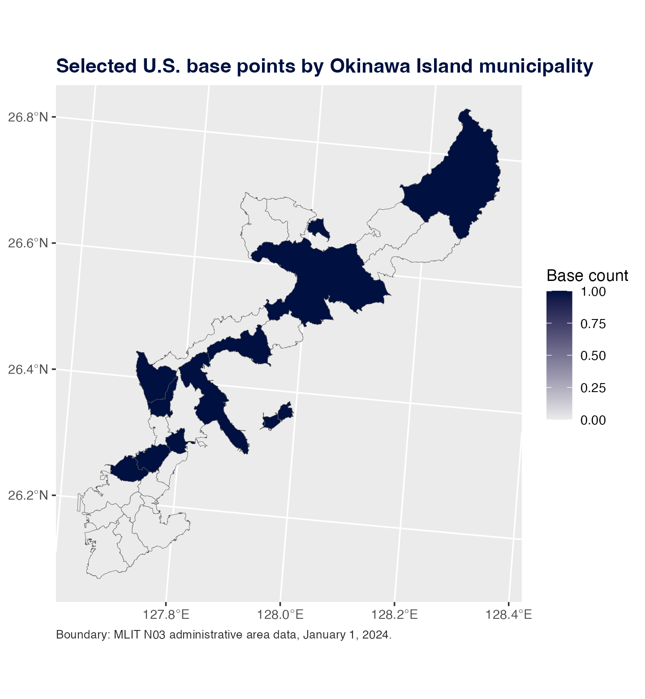

# Plot Municipal Choropleth Maps

The package includes official MLIT N03 municipal boundaries for Okinawa
Prefecture as of January 1, 2024. This example counts selected U.S. base
point locations by municipality and maps one fill variable:
`base_count`. The figure focuses on Okinawa Island so the municipal
boundaries and base locations are legible; the bundled boundary file
still contains the rest of Okinawa Prefecture.

``` r

library(tidyverse)
library(jpmap)

okinawa_bases <- jp_us_military_bases |>
  filter(
    prefecture == "Okinawa",
    base != "Okinawa U.S. military facilities"
  )

okinawa_main_island <- c(
  "那覇市", "宜野湾市", "浦添市", "名護市", "糸満市", "沖縄市",
  "豊見城市", "うるま市", "南城市", "国頭村", "大宜味村", "東村",
  "今帰仁村", "本部町", "恩納村", "宜野座村", "金武町", "読谷村",
  "嘉手納町", "北谷町", "北中城村", "中城村", "西原町", "与那原町",
  "南風原町", "八重瀬町"
)
okinawa_main_island_min_area <- 5e6
keep_okinawa_main_island <- function(map) {
  filtered <- map |>
    filter(municipality_ja %in% okinawa_main_island)

  filtered |>
    mutate(area_m2 = as.numeric(sf::st_area(filtered))) |>
    filter(area_m2 >= okinawa_main_island_min_area) |>
    select(-area_m2)
}

okinawa_file <- available_jpmap_data() |>
  filter(year == 2024, pref_code == "47") |>
  pull(path) |>
  first()

okinawa_wgs84 <- sf::st_read(okinawa_file, layer = "municipalities", quiet = TRUE) |>
  keep_okinawa_main_island()

base_points <- sf::st_as_sf(
  okinawa_bases,
  coords = c("lon", "lat"),
  crs = 4326,
  remove = FALSE
)

base_counts <- sf::st_join(
  base_points,
  okinawa_wgs84["municipality_code"],
  left = FALSE
) |>
  sf::st_drop_geometry() |>
  count(municipality_code, name = "base_count")

okinawa_main_map <- jp_map("municipality", include = "Okinawa", inset = FALSE) |>
  keep_okinawa_main_island() |>
  jp_map_join(base_counts, values = "base_count") |>
  mutate(base_count = replace_na(base_count, 0L))
#> Warning: 17 map region key(s) in `municipality_code` did not receive data
```

``` r

ggplot(okinawa_main_map) +
  geom_sf(
    aes(fill = base_count),
    color = "grey35",
    linewidth = 0.12
  ) +
  coord_sf(
    crs = jpmap_crs(),
    datum = sf::st_crs(4326)
  ) +
  scale_fill_gradient(
    low = "grey92",
    high = "#001040",
    name = "Base count"
  ) +
  labs(
    title = "Selected U.S. base points by Okinawa Island municipality",
    caption = "Boundary: MLIT N03 administrative area data, January 1, 2024."
  ) +
  theme_gray() +
  theme(
    axis.title = element_blank(),
    panel.grid.minor = element_blank(),
    legend.background = element_rect(fill = "white", color = NA),
    plot.title = element_text(face = "bold", color = "#001040"),
    plot.caption = element_text(color = "#2C2A29", hjust = 0, size = 8)
  )
```



For other prefectures, first build the prefecture’s municipal boundaries
with `jpmap_build_data(year = 2024, prefecture = "...")`, then use the
same join pattern.
