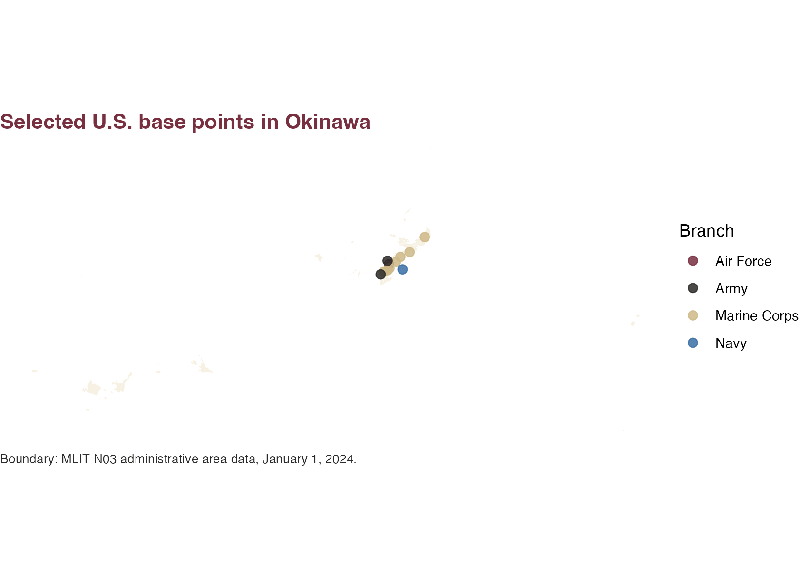

# Plot Municipal Point Maps

This example plots selected U.S. base coordinates on Okinawa municipal
boundaries. The map uses one point variable: `branch`.

``` r

library(ggplot2)
library(jpmap)

data("jp_us_military_bases")

okinawa_bases <- jp_us_military_bases[
  jp_us_military_bases$prefecture == "Okinawa" &
    jp_us_military_bases$base != "Okinawa U.S. military facilities",
]

okinawa_bases_xy <- jpmap_transform(
  okinawa_bases,
  output_names = c("x", "y"),
  inset = FALSE
)
```

``` r

plot_jpmap(
  "municipality",
  include = "Okinawa",
  inset = FALSE,
  fill = "#F7F1E4",
  color = "white",
  linewidth = 0.05
) +
  geom_point(
    data = okinawa_bases_xy,
    aes(x = x, y = y, color = branch),
    size = 2.4,
    alpha = 0.85
  ) +
  scale_color_manual(
    values = c(
      "Air Force" = "#782F40",
      "Army" = "#2C2A29",
      "Marine Corps" = "#CEB888",
      "Navy" = "#3A6EA5"
    ),
    name = "Branch"
  ) +
  labs(
    title = "Selected U.S. base points in Okinawa",
    caption = "Boundary: MLIT N03 administrative area data, January 1, 2024."
  ) +
  theme(
    plot.background = element_rect(fill = "white", color = NA),
    panel.background = element_rect(fill = "white", color = NA),
    legend.background = element_rect(fill = "white", color = NA),
    plot.title = element_text(face = "bold", color = "#782F40"),
    plot.caption = element_text(color = "#2C2A29", hjust = 0, size = 8)
  )
```



The only mapped base variable is `branch`. Point size, alpha, and
boundary style are fixed.
