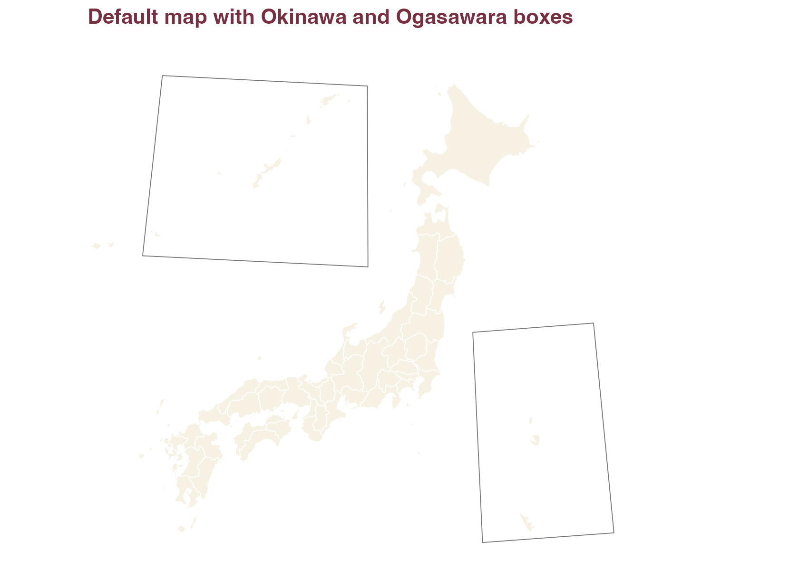
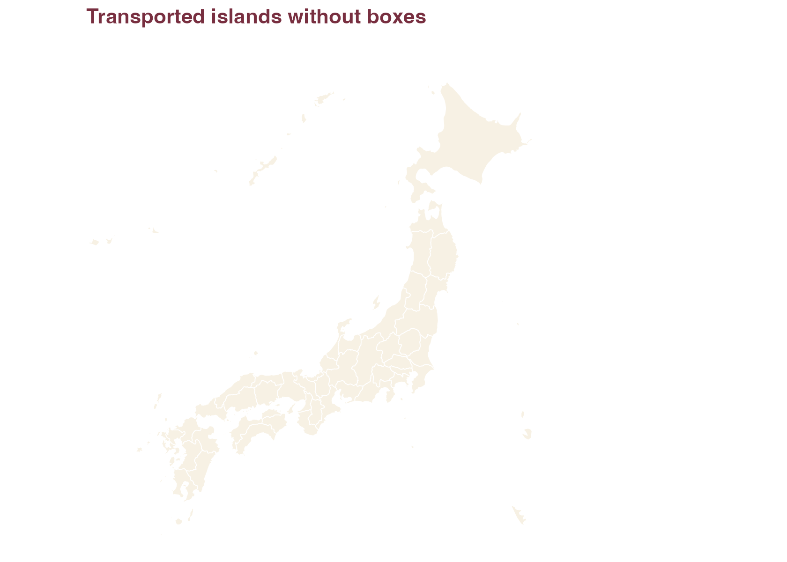
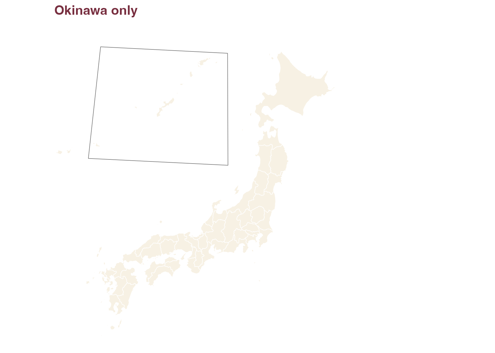
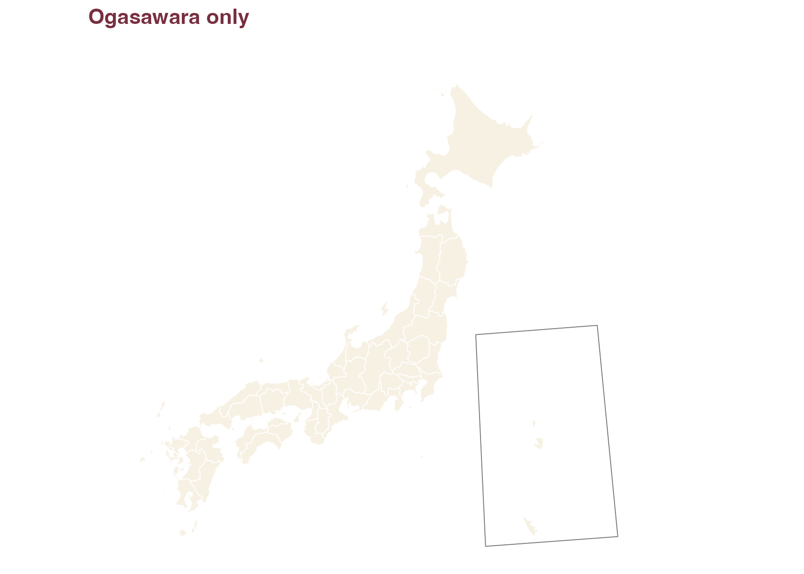
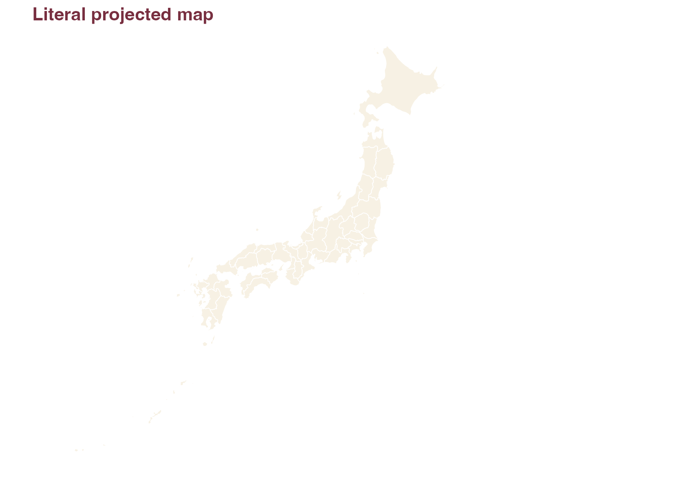

# Plot Maps

[`plot_jpmap()`](https://yhoriuchi.github.io/jpmap/reference/plot_jpmap.md)
returns a normal `ggplot2` object. You can add scales, labels, and
additional layers just as you would with any other `ggplot2` map.

``` r

library(jpmap)
library(ggplot2)
```

``` r

plot_jpmap(
  "prefectures",
  fill = "#F7F1E4",
  color = "white",
  linewidth = 0.25
) +
  labs(title = "Default map with Okinawa and Ogasawara boxes") +
  theme(
    plot.background = element_rect(fill = "white", color = NA),
    panel.background = element_rect(fill = "white", color = NA),
    plot.title = element_text(face = "bold", color = "#782F40")
  )
```



## Inset Options

Remove inset boxes when you want the transported islands without frames.

``` r

plot_jpmap(
  "prefectures",
  inset_boxes = FALSE,
  fill = "#F7F1E4",
  color = "white",
  linewidth = 0.25
) +
  labs(title = "Transported islands without boxes") +
  theme(
    plot.background = element_rect(fill = "white", color = NA),
    panel.background = element_rect(fill = "white", color = NA),
    plot.title = element_text(face = "bold", color = "#782F40")
  )
```



Exclude Ogasawara when it is not relevant to the map.

``` r

plot_jpmap(
  "prefectures",
  ogasawara = FALSE,
  fill = "#F7F1E4",
  color = "white",
  linewidth = 0.25
) +
  labs(title = "Okinawa only") +
  theme(
    plot.background = element_rect(fill = "white", color = NA),
    panel.background = element_rect(fill = "white", color = NA),
    plot.title = element_text(face = "bold", color = "#782F40")
  )
```



Exclude Okinawa when you want to focus on the main islands and
Ogasawara.

``` r

plot_jpmap(
  "prefectures",
  okinawa = FALSE,
  fill = "#F7F1E4",
  color = "white",
  linewidth = 0.25
) +
  labs(title = "Ogasawara only") +
  theme(
    plot.background = element_rect(fill = "white", color = NA),
    panel.background = element_rect(fill = "white", color = NA),
    plot.title = element_text(face = "bold", color = "#782F40")
  )
```



Use `inset = FALSE` for a geographically literal projected map.

``` r

plot_jpmap(
  "prefectures",
  inset = FALSE,
  fill = "#F7F1E4",
  color = "white",
  linewidth = 0.25
) +
  labs(title = "Literal projected map") +
  theme(
    plot.background = element_rect(fill = "white", color = NA),
    panel.background = element_rect(fill = "white", color = NA),
    plot.title = element_text(face = "bold", color = "#782F40")
  )
```



## Municipal Boundaries

``` r

plot_jpmap("municipalities", include = "Okinawa", linewidth = 0.1)
```

## Choropleths

Join data by a common administrative code or name column and set
`values` to the column that should be mapped to fill color.

``` r

population <- data.frame(
  pref_code = c("13", "27", "47"),
  population = c(14000000, 8800000, 1460000)
)

plot_jpmap(
  "prefectures",
  data = population,
  values = "population"
) +
  scale_fill_continuous(low = "#F7F1E4", high = "#782F40")
```
