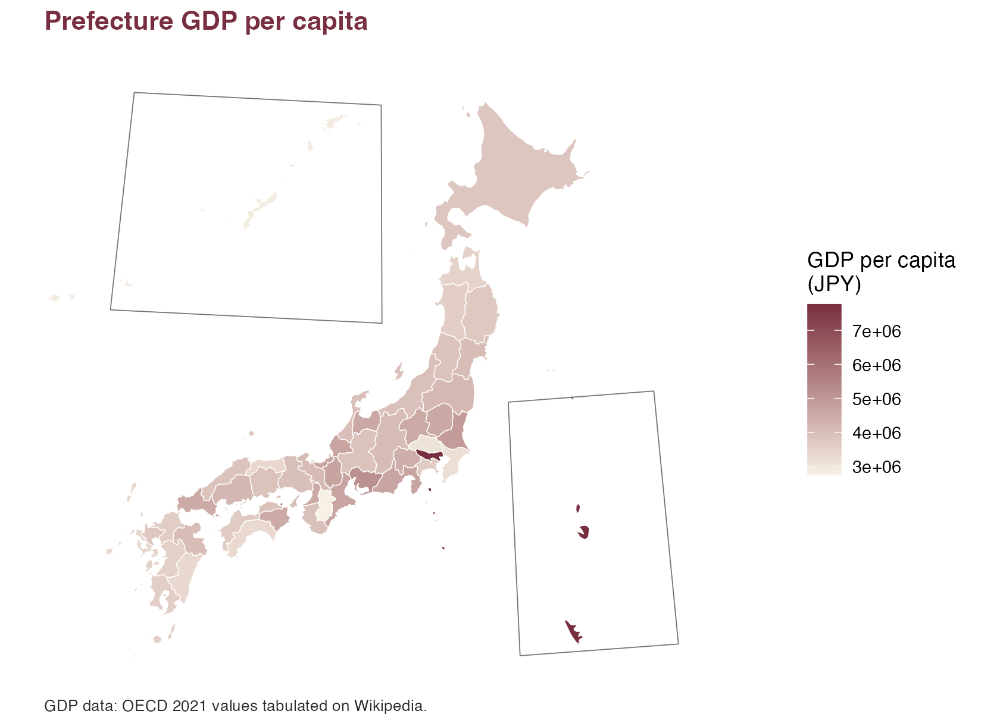

# Plot Prefectural Choropleth Maps

This example uses `jp_prefecture_gdp`, a bundled prefecture-level GDP
dataset. The map uses one fill variable: GDP per capita in Japanese yen.

``` r

library(ggplot2)
library(jpmap)

data("jp_prefecture_gdp")
```

``` r

plot_jpmap(
  "prefecture",
  data = jp_prefecture_gdp,
  values = "gdp_per_capita_jpy",
  color = "white",
  linewidth = 0.2
) +
  scale_fill_gradient(
    low = "#F7F1E4",
    high = "#782F40",
    name = "GDP per capita\n(JPY)"
  ) +
  labs(
    title = "Prefecture GDP per capita",
    caption = "GDP data: OECD 2021 values tabulated on Wikipedia."
  ) +
  theme(
    plot.background = element_rect(fill = "white", color = NA),
    panel.background = element_rect(fill = "white", color = NA),
    legend.background = element_rect(fill = "white", color = NA),
    plot.title = element_text(face = "bold", color = "#782F40"),
    plot.caption = element_text(color = "#2C2A29", hjust = 0, size = 8)
  )
```



[`plot_jpmap()`](https://yhoriuchi.github.io/jpmap/reference/plot_jpmap.md)
joins by a shared column. Here both the map and `jp_prefecture_gdp` have
`pref_code` and `prefecture`, so no extra join argument is needed.
