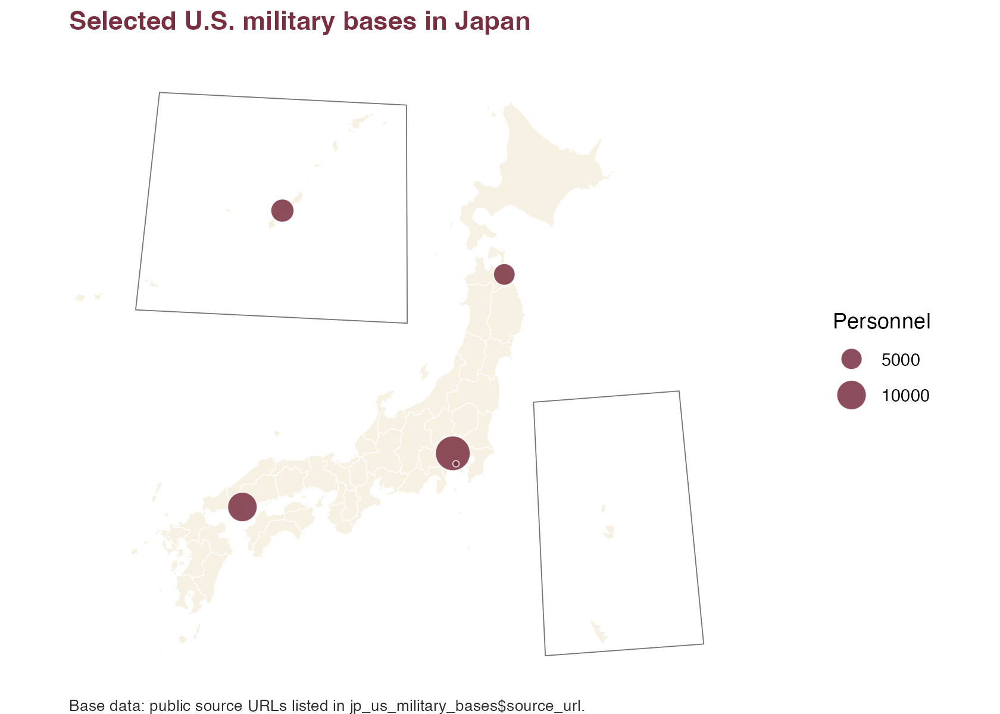

# Plot Prefectural Point Maps

This example uses `jp_us_military_bases`. The map uses one point
variable: `personnel`. To keep the example simple, it uses rows marked
as base-specific public personnel figures.

``` r

library(ggplot2)
library(jpmap)

data("jp_us_military_bases")

bases <- jp_us_military_bases[
  !is.na(jp_us_military_bases$personnel) &
    jp_us_military_bases$personnel_is_base_specific,
]

bases_xy <- jpmap_transform(bases, output_names = c("x", "y"))
```

``` r

plot_jpmap(
  "prefecture",
  fill = "#F7F1E4",
  color = "white",
  linewidth = 0.2
) +
  geom_point(
    data = bases_xy,
    aes(x = x, y = y, size = personnel),
    shape = 21,
    fill = "#782F40",
    color = "white",
    alpha = 0.85,
    stroke = 0.35
  ) +
  scale_size_area(max_size = 8, name = "Personnel") +
  labs(
    title = "Selected U.S. military bases in Japan",
    caption = "Base data: public source URLs listed in jp_us_military_bases$source_url."
  ) +
  theme(
    plot.background = element_rect(fill = "white", color = NA),
    panel.background = element_rect(fill = "white", color = NA),
    legend.background = element_rect(fill = "white", color = NA),
    plot.title = element_text(face = "bold", color = "#782F40"),
    plot.caption = element_text(color = "#2C2A29", hjust = 0, size = 8)
  )
```



The prefectures are only geographic context here. The only mapped data
variable is the point size for `personnel`.
