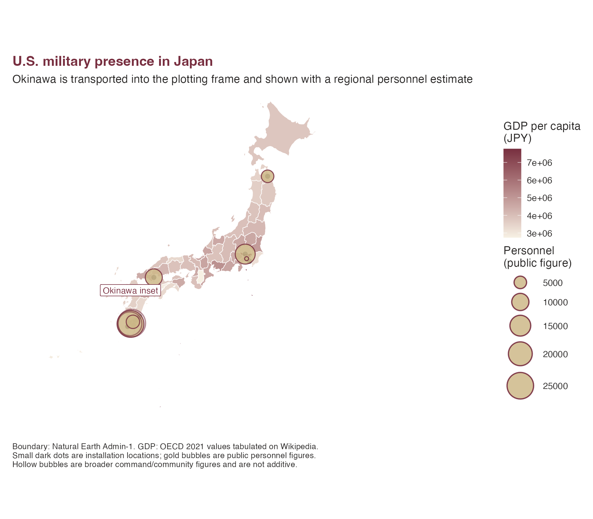

# U.S. Military Bases and Prefecture GDP

This example combines two sample datasets:

- `jp_prefecture_gdp`, used to fill prefectures by GDP per capita.
- `jp_us_military_bases`, used to draw selected U.S. military
  installations and public personnel figures where those figures have a
  clear source.

Installation-level personnel counts are not published consistently. The
map therefore uses small dark points for installation locations and
larger gold bubbles only for public personnel figures. The Okinawa
bubble is a regional personnel estimate, not a count for a single base.

The bundled prefecture boundaries come from Natural Earth. They are
useful for examples and website figures; use
[`jpmap_build_data()`](https://yhoriuchi.github.io/jpmap/reference/jpmap_data.md)
when you need detailed MLIT municipal boundaries.

``` r

library(ggplot2)
library(jpmap)

data("jp_prefecture_gdp")
data("jp_us_military_bases")

example_data_dir <- system.file("extdata", package = "jpmap")

bases_xy <- jpmap_transform(
  jp_us_military_bases,
  output_names = c("x", "y")
)

personnel_xy <- bases_xy[
  !is.na(bases_xy$personnel) &
    bases_xy$personnel_geography %in% c("regional", "installation"),
]

context_xy <- bases_xy[
  !is.na(bases_xy$personnel) &
    bases_xy$personnel_geography %in% c("command", "installation-community"),
]

okinawa_label <- jpmap_transform(
  data.frame(lon = 127.80, lat = 26.35),
  output_names = c("x", "y")
)
```

``` r

plot_jpmap(
  "prefectures",
  data = jp_prefecture_gdp,
  values = "gdp_per_capita_jpy",
  data_year = 2021,
  data_dir = example_data_dir,
  color = "white",
  linewidth = 0.25
) +
  geom_point(
    data = bases_xy,
    aes(x = x, y = y),
    shape = 21,
    size = 2.3,
    fill = "#2C2A29",
    color = "white",
    alpha = 0.75,
    stroke = 0.35
  ) +
  geom_point(
    data = personnel_xy,
    aes(x = x, y = y, size = personnel),
    shape = 21,
    fill = "#CEB888",
    color = "#782F40",
    alpha = 0.85,
    stroke = 0.7
  ) +
  geom_point(
    data = context_xy,
    aes(x = x, y = y, size = personnel),
    shape = 21,
    fill = NA,
    color = "#782F40",
    alpha = 0.55,
    stroke = 0.9
  ) +
  annotate(
    "label",
    x = okinawa_label$x,
    y = okinawa_label$y + 240000,
    label = "Okinawa inset",
    label.r = grid::unit(0.08, "lines"),
    fill = "white",
    color = "#782F40",
    size = 3
  ) +
  scale_fill_gradient(
    low = "#F7F1E4",
    high = "#782F40",
    name = "GDP per capita\n(JPY)"
  ) +
  scale_size_area(
    max_size = 12,
    name = "Personnel\n(public figure)"
  ) +
  labs(
    title = "U.S. military presence in Japan",
    subtitle = "Okinawa is transported into the plotting frame and shown with a regional personnel estimate",
    caption = paste(
      "Boundary: Natural Earth Admin-1. GDP: OECD 2021 values tabulated on Wikipedia.",
      "Small dark dots are installation locations; gold bubbles are public personnel figures.",
      "Hollow bubbles are broader command/community figures and are not additive.",
      sep = "\n"
    )
  ) +
  theme(
    plot.background = element_rect(fill = "white", color = NA),
    panel.background = element_rect(fill = "white", color = NA),
    legend.background = element_rect(fill = "white", color = NA),
    plot.margin = margin(12, 12, 12, 12),
    plot.title = element_text(face = "bold", color = "#782F40"),
    plot.subtitle = element_text(color = "#2C2A29"),
    plot.caption = element_text(color = "#2C2A29", hjust = 0, size = 8),
    legend.title = element_text(color = "#2C2A29"),
    legend.text = element_text(color = "#2C2A29"),
    legend.position = "right"
  )
```



The personnel figures are intentionally stored with `personnel_scope`
and `personnel_geography` because public numbers differ in what they
count. Treat the dataset as a reproducible package example rather than
an official accounting of U.S. forces in Japan.
